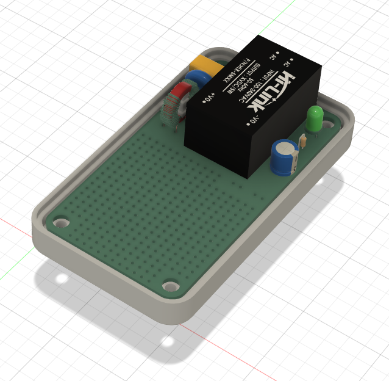

# AC-Wall-Adapter-PCB
An AC wall adapter PCB to power &amp; consolidate your IoT projects into a single housing without using ugly USB phone chargers

 

## Bill of Materials

Required components:
- AC Wall Adapter PC Board - order from [here](https://www.tindie.com/products/shencentral/ac-wall-adapter-pcb-for-iot-projects-us-plug/)
- US AC two-prong plug (included with PCB order)
- F1 - PCB Fuse 0.5A, 250V
- AC-DC Converter module - HiLink HLK PMXX or 5MXX series
- All-in-One AC Wall Adapter PC Board
- 3D printed enclosure

  
Components for RFI, surge protection, & power indication:
- RV1 - MOV 10D561K 
- L1 - Common mode choke inductor 10mH or 15mH, 500mA min, 270V (ex: Wurth 74482111)
- C1 - 0.1uF, 275V
- C2 - 220uF, voltage suitable for +Vout
- R1 - Use value suitable for +Vout & D1

 

## Printed Circuit Board

The main component of the PCB is the Hi-Link AC-DC converter.  The PCB is designed to accomodate either the HLK-PMxx or the HLK-5Mxx series component footprint.  They are avaialabe in varying voltage and power combinations.  You can find them on Amazon, AliExpress, and other sources.

The PCB footprint for the fuse accomodates a "PCB fuse".  They are again available from Amazon or Aliexpress and other sources.  The silkscreen indicates a rectangular shape for the fule, but the radial (circular) style will also fit.

The PCB has provisions for optional RFI, surge protection, and power indication components.  The Hi-Link AC-DC adapter will work without these components, obviously without the benfits of them.  Be sure to install jumpers if the common mode inductor (see L1 on PCB) is not installed.

The prototyping grid will accomodate most ESP8266 & ESP32 "development boards" with some modest space leftover for sensor or connector attachment.  If additional room is needed, you can use the room to attach a header for piggybacking another prototyping PCB above.  The 3D printed case can be modified using Fusion360 for height.  Just be sure not to smother your WiFi signal by being too dense near it.

Schematic and layout [here](https://github.com/heyitsyang/AC-Wall-Adapter-PCB/tree/main/Schematic_and_Layout)

 

## 3D Printed Enclosure

STL files and the Fusion360 design file is provided.  When modifying the Fusion360 files to change dimensions, CAPITALIZED parameter names have been tested.  Editing other parameters may yield unexpected results.

Print the following:
- Enclosure top (your choice of two styles)
- Enclosure bottom
- AC plug shim

Two options for the 3D printed enclosure are included:
- Flat top - normal enclosre with a flat top
- Tented top - top with angled sides for slimmer look at the expense of potentially useful volume

One very important, but easily overlooked component that must be printed is the shim for the plug.  The shim is a plastic spacer that must be installed between the PCB and the plug before soldering the plug.  When populating the PCB, *the shim and AC plug must be installed before the Hi-Link AC-DC converter.*  The shim provides the required offset for PCB, AC plug and enclosure.

 

## Images

Enclosure with flat top option

Enclosure with tented top option

Populated PCB

Shim installation
