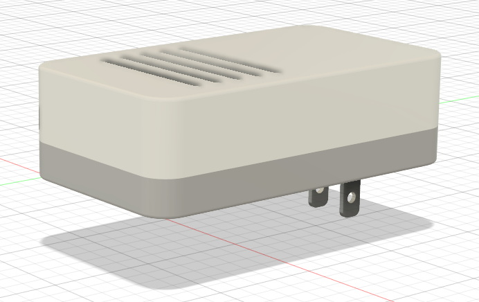
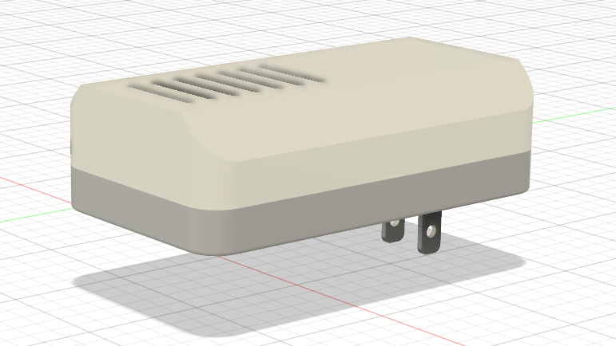
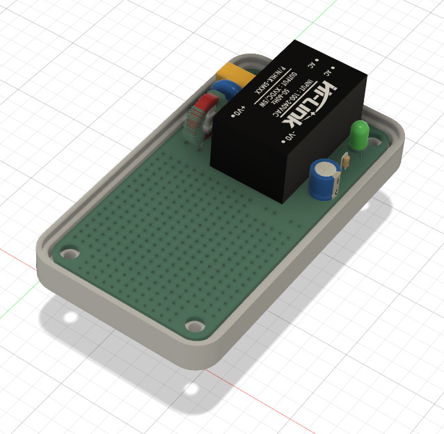
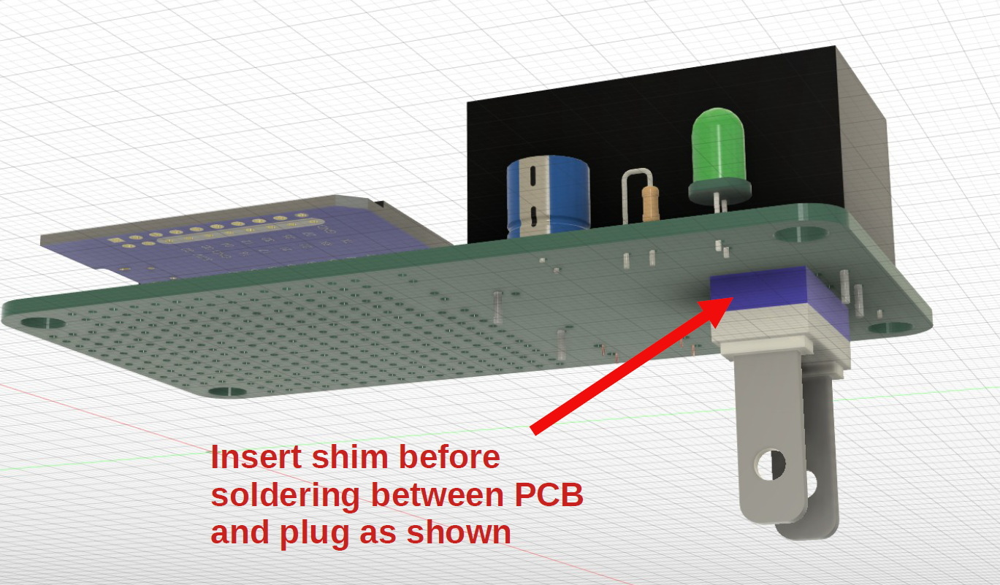

# AC-Wall-Adapter-PCB
An AC wall adapter PCB to power &amp; consolidate your IoT & DIY project into a single housing without resorting to an ugly USB phone charger

 

## Bill of Materials

Required components:
- Qty 1 - AC Wall Adapter PC Board - [order from here](https://www.tindie.com/products/shencentral/ac-wall-adapter-pcb-for-iot-projects-us-plug/)
- Qty 1 - US AC two-prong plug (included with PCB order)
- Qty 1 - F1 - Miniature PCB Fuse 0.5A, 250V - rectangular or TR5/5TR style (ex. Littlefuse 37005000410)
- Qty 1 - AC-DC Converter module - Hi-Link HLK PMXX or 5MXX series
- Qty 1 - 3D printed enclosure

  
Components for EMI suppression, surge protection, & power indication:
- Qty 1 - RV1 - Varistor 10D561K (ex. Bourns MOV-10D561K)
- Qty 1 - L1 - Common mode choke inductor 10mH or 15mH, 500mA min, 270V (ex. Wurth 74482111)
- Qty 1 - C1 - 0.1uF, 275VAC polypropylene capacitor (ex. MEX/TENTA 275V104P10)
- Qty 1 - C2 - 220uF, 35V capacitor
- Qty 1 - D1 - LED
- Qty 1 - R1 - Resistor, use value suitable for +Vout & D1

 

## Printed Circuit Board

The main component of the PCB is the Hi-Link AC-DC converter.  The PCB is designed to accomodate either the HLK-PMxx or the HLK-5Mxx series component footprint.  They are available in several voltages.  You can find them on Amazon, AliExpress, and other sources.

The PCB footprint for the fuse accomodates a miniature PCB fuse.  They are again available from Amazon or Aliexpress and other sources.  The PCB silkscreen indicates a rectangular footprint shape for the fuse, but the radial (TR5/5TR) style will also fit.  (Search for "pcb fuse 0.5a 250v TR5")

The PCB has provisions for optional EMI suppression, surge protection, and power indication components.  The Hi-Link AC-DC adapter will work without these components, obviously without the benefits they provide.  Be sure to install jumpers if the common mode inductor (see L1 on PCB) is not installed.

The prototyping grid will accomodate most ESP8266 & ESP32 "development boards" with some modest space leftover for sensor or connector attachment.  If additional room is needed, you can use the room to attach a header for piggybacking another prototyping PCB above.  The 3D printed case can be modified using Fusion360 for height.  Just be sure not to smother your WiFi signal by being too dense near it.

Schematic and layout [here](https://github.com/heyitsyang/AC-Wall-Adapter-PCB/tree/main/Schematic_and_Layout)

 

## 3D Printed Enclosure

STL mesh files and the Fusion360 design file are provided.  The Fusion360 design file is parametric in X,Y & Z directions.  When modifying the Fusion360 design to change dimensions, editing CAPITALIZED parameter values is safe/tested.  Editing other parameters may yield unexpected results.

Print the following:
- Enclosure top (choice of two styles)
- Enclosure bottom
- AC plug shim

Two options for the 3D printed enclosure are included:
- Flat top - normal enclosure with a flat top - better if you need side portals for connectors
- Tented top - top with angled sides for a slimmer look at the expense of potentially useful volume

One very important, but easily overlooked component that must be printed is the shim for the plug.  The shim is a plastic spacer that must be installed between the PCB and the plug before soldering the plug.  When populating the PCB, *the shim and AC plug must be installed before the Hi-Link AC-DC converter.*  The shim provides the required critical offset for PCB mounting, AC plug protrusion, and enclosure bottom design.  If you choose to design your own enclosure, the plug offset is the critical measurement that drives the design for the enclosure bottom.

Supports should not be necessary for printing.  Enclosure halves are fastened using #4 0.5 inch or M3 screws.

 

## Images

Enclosure with flat top option

Enclosure with tented top option

Populated PCB

Shim installation
